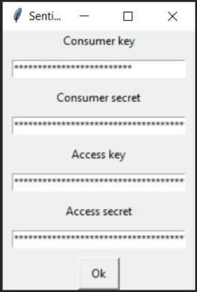
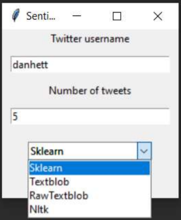
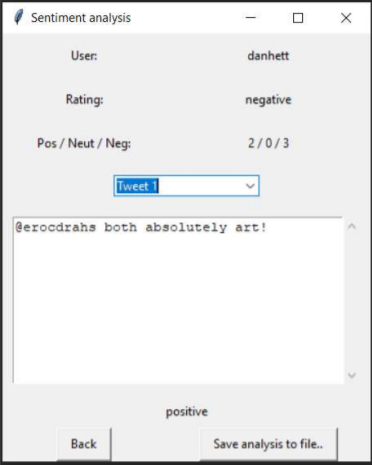

# Tweeter-sentiment-analysis
A GUI application which lets you analyse Tweets of chosen user. App works with Twitter API and uses strategy design pattern.
Program has been written in Python 3, using Tkinter, Tweepy, Sklearn, Textblob and nltk libraries.

## Table of content
* [General info](#general-info)
* [Screenshots](#screenshots)
* [Technologies](#technologies)
* [Architeture](#architecture)
* [Contact](#contact)

## General info
My main goal was to create a program which can execute sentiment analysis of Twitter posts of chosen user.  
Program can establish if the tweet is positive, negative or neutral by using one of four different algorithms.  
I've used public tweets database called Sentiment140 as a training set.  
User have to provide their own api keys for Twitter api for the application to work at all. Next, provide username, number of tweets to analyse and pick one of algorithms.

## Screenshots
  
  

## Technologies
* Python 3
* Tkinter
* Tweepy
* Sklearn
* Textblob
* nltk

## Architecture
Starting point of app is in main.py file, where objects for GUI and logic are created.  
GUI and logic are separated from each other. In the utils folder you can find separated functions of the program, i.e. database service, sentiment analysis service, Twitter API service and file for constant values.  
For sentiment analysis I've used the strategy design pattern which allows user to choose between multiple ways of analysing sentiment (as shown in screenshots section).

## Contact
Created by **Jędrzej Ratajczak** ([@nilphym](https://github.com/nilphym)) - feel free to contact me!
